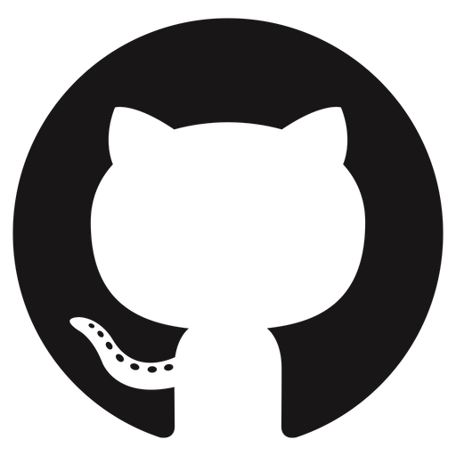

- 👋 Hi, I’m @yd3112
- 👀 I’m interested in C++,Python and MERN stack
- 🌱 I’m currently learning Node.js with Express.js and React.js
- 💞️ I’m looking to collaborate on Hecktoberfest
- 📫 How to reach me pokar.yashusmile@gmail.com or +91 6353522837

<!---
yd3112/yd3112 is a ✨ special ✨ repository because its `README.md` (this file) appears on your GitHub profile.
You can click the Preview link to take a look at your changes.
--->
<h2 align="left" id="yd3112-tech">Favorite Tech & Stats</h2>

> Tools, languages, and other things that I like to work with.
<table>
  <tr>
    <td align="center" width="96">
      
       Node.js
    </td>
    <td align="center" width="96">
      
       Express
    </td>
    <td align="center" width="96">
      
       Reactjs
    </td>
    <td align="center" width="96">
      
       TypeScript
    </td>
     <td align="center" width="96">
      
       Laravel
    </td>
    <td align="center" width="96">
      
       MySql
    </td>
    <td align="center" width="96">
      
       Postgresql
    </td>
    <td align="center" width="96">
      
       MongoDB
    </td>
    <td align="center" width="96">
      
       AWS
    </td>
   
  </tr>
  <tr>
    <td align="center" width="96">
      
       Graphql
    </td>
   <td align="center" width="96">
      
       Docker
    </td>
    <td align="center" width="96">
      
       Rust
    </td>
    <td align="center" width="96">
      
       GitHub
    </td>
    <td align="center" width="96">
      
       Mac
    </td>
    <td align="center" width="96">
      
       Linux
    </td>
    <td align="center" width="96">
      
       Nginx
    </td>
    <td align="center" width="96">
      
       Discord
    </td>
    <td align="center" width="96">
      
       Slack
    </td>
  </tr>
</table>
